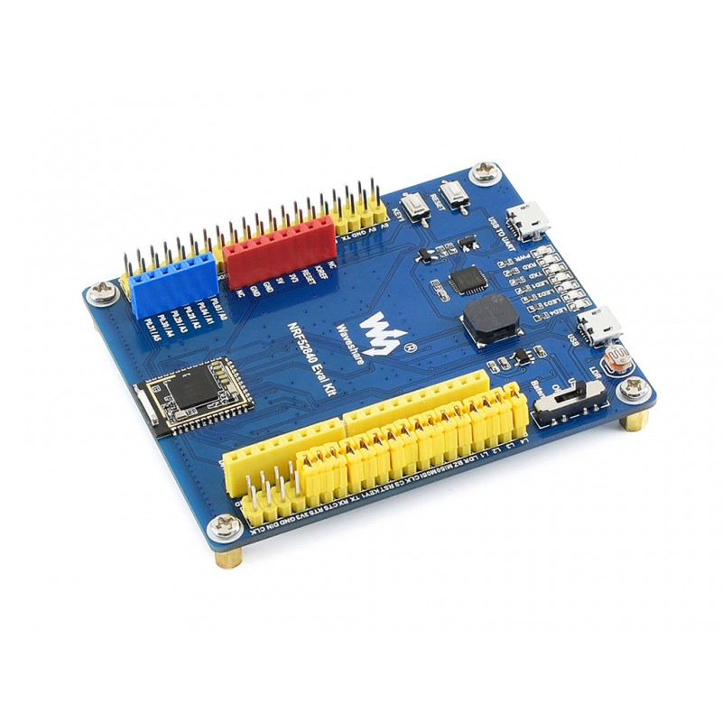

Arduino BSP Files for Waveshare nRF52840 Eval Kit
==================================================

This repository contains the Arduino BSP for Waveshare nRF52840 Eval Kit:

- [Waveshare nRF52840 Eval Kit](https://www.waveshare.com/nrf52840-eval-kit.htm)


## Bootloader Installation

At first, you have to burn the bootloader to your development board. You can use the pre-built bootloader in the bootloader directory. Or you can make it directly from source code as follows.

 1. Install the source code as to [Adafruit_nRF52_Bootloader](https://github.com/adafruit/Adafruit_nRF52_Bootloader)
 2. copy the file "bootloader/src/boards/nrf52840\_evk.h" to the original directory.
 3. build the bootloader by following command. Then the bootloader will be reside in "bin" directory.
```
$ make BOARD=nrf52840_evk release
```

To burn the bootloader manually via SWD port of the board, you will need the following tools installed on your system and available in the system path:

- in case of J-link debugger, Nordic [nRF5x Command Line Tools](http://infocenter.nordicsemi.com/index.jsp?topic=%2Fcom.nordic.infocenter.tools%2Fdita%2Ftools%2Fnrf5x_command_line_tools%2Fnrf5x_installation.html)
```
$ nrfjprog -e -f nrf52
$ nrfjprog --program nrf52840_evk_bootloader-0.2.7_s140_6.1.1.hex -f nrf52
$ nrfjprog --reset -f nrf52
```

- in case of stlink-v2 debugger, open-source [OpenOCD](https://openocd.org)
```
$ openocd -f interface/stlink.cfg -f target/nrf52.cfg -c "program nrf52840_evk_lootloader-0.2.7_s140_6.1.1.hex verify reset ; shutdown"
```

## BSP Installation

 1. Install Adafruit nRF52 Arduino Core with tools via the Arduino Board Manager as to [Adafruit nRF52 Arduino Core](https://www.github.com/adafruit/Adafruit_nRF52_Arduino)
 2. Goto the core folder `nrf52` installed by Board Manager in Adruino15, depending on your OS. It could be
  * macOS  : `~/Library/Arduino15/packages/adafruit/hardware/nrf52`
  * Linux  : `~/.arduino15/packages/adafruit/hardware/nrf52`
  * Windows: `%APPDATA%\Local\Arduino15\packages\adafruit\hardware\nrf52`
 3. Open **open boards.txt**. Scroll to the bottom and **paste the contents of waveshare\_boards.txt** into the bottom of that file.
 4. Then copy the contents of the "variants" folder in this directory into the "variants" folder of the original directory. Nothing should be overwritten, but a new "waveshare\_nrf52840\_evk" directory should be added in.
 5. Restart the Arduino IDE
 6. Once the BSP is installed, select 'Waveshare nRf52840 Eval Kit' from the Tools -> Board menu, which will update your system config to use the right compiler and settings for the nRF52.

## Arduino BLE Application Support

This Arduino core contains basic BLE peripheral mode helper classes and APIs
to make it easier to work with the Nordic SoftDevice that contains Nordic's
official Bluetooth Low Energy stack. You are also free to use the Nordic SDK
to generate your own example code. To look for a list of example sketches that
make use of these helper classes, then go to the `File -> Examples -> Adafruit
Blefruit nRF52 libraries` menu.

We offer two additional examples as follows.
 1. Ble-app-blinky program controlled by Nordic nRF blinky app.
 2. Ble-app-hrm program calculates the heart rate with Sparkfun's [AD8232 module](https://www.sparkfun.com/products/12620) that measure ECG signal, then send it to Nordic nRF toolbox app.

## Credits

This core is based on [Adafruit nRF52 Arduino Core](https://github.com/adafruit/Adafruit_nRF52_Arduino) by [Adafruit](https://www.adafruit.com).

The custom heart rate monitoring program uses QRS detection algorithm by [Blake Milner](https://github.com/blakeMilner/real_time_QRS_detection).
